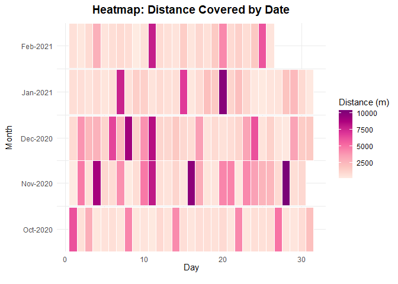
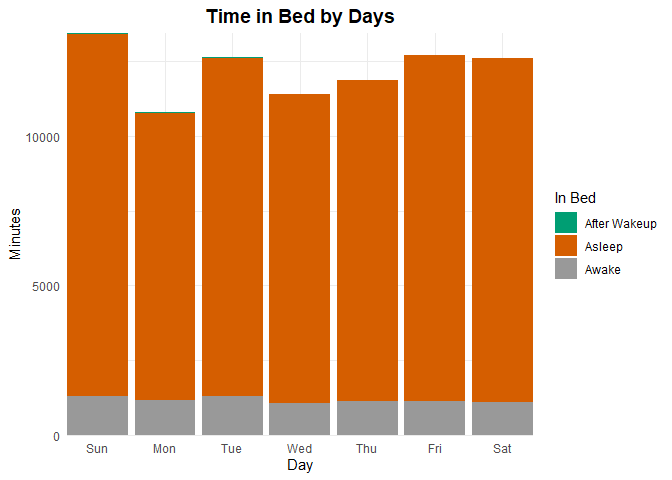
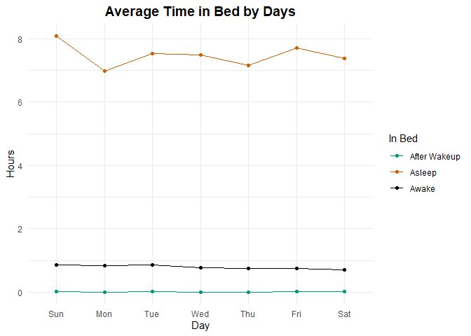
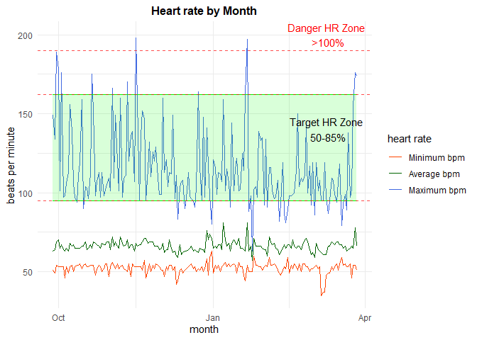

Fredrick Boshe
20/04/2021

<center>

# Lockdown Fitness💪: A FitBit Story ⌚

</center>

### An analysis of how the lockdown in Germany may have affected Fitness levels

Being in Germany the past 15 months means a state of endless lockdowns
to curb the spread of the virus. While these lockdowns have had some
positive results in keeping the waves of spread low in Germany, they
have undoubtedly taken physical and mental toll on people. The sense of
time, purpose and social behaviors have been negatively impacted. While
it would be hard to actively track of how one’s body reacts to
everything, technology has given us tools that can do this for us.

I am the proud owner of a FitBit Charge 2, which is roughly 5 years
old(!?) but still works like a charm. I graduated last year in
September, left my student working position, changed cities and
experienced my 3rd winter ever. All while going through a pandemic
lockdown. Personally, i felt it took its toll, but i wanted to get
better insights from my FitBit to analyze just how much the pattern was
disrupted.

Questions looking to be answered are:

1.  How did my daily fitness levels trend between October 2020 and March
    2021?
2.  How did my sleep quantity and quality change during the same time
    period? Is there any relationship between my fitness and my quality
    of sleep?
3.  How was my heart-rate/health throughout this period? Are the
    perceptions related to/influenced by the demographics and success
    metrics of the school?

I utilize my FitBit data that i
[exported](https://help.fitbit.com/articles/en_US/Help_article/1133.htm)
to try and answer these questions and provide context to key
observations. The data comes in JSON format, which can be tricky for
some people to parse through. You can uses this [Github
page](https://iccir919.github.io/fitbit-json-to-csv/) that helps convert
your JSON files to CSV.

### Data: Importing and Cleaning

``` r
#Load datasets
## Method1: as CSV
alt<-read_csv("Dataset/Altitude.csv")
dis<-read_csv("Dataset/Distance.csv")
hrt1<-read_csv("Dataset/Heartrate1.csv")
hrt2<-read_csv("Dataset/Heartrate2.csv")
lam<-read_csv("Dataset/Light active minutes.csv")
mam<-read_csv("Dataset/Moderate active minutes.csv")
sam<-read_csv("Dataset/Sedentary minutes.csv")
vam<-read_csv("Dataset/Very active minutes.csv")
slp_sc<-read_csv("Dataset/sleep_score.csv")

## Method2: as JSON and turn it into a dataframe
path <- "./Dataset/Sleep/"
files <- dir(path, pattern = "*.json")

slp <- files %>%
  map_df(~fromJSON(file.path(path, .), flatten = TRUE))

#Date: Separate date and time (time is not relevant for this analysis)
#Separate date variable
alt<-alt%>%
  separate(Date,
           into=c("date", "time"),
           sep=" ")%>%
  select(-time)  

#Standardize dates and rename variables
alt$date<-mdy(alt$date)
alt<-alt%>%
  rename(altitude=Altitude) 

#Repeat process for all datasets. 
```

The “Date” column is designated as a character in all dataframes. It
needs to be converted into in a “Date” data type. Since time is not of
importance for this analysis, i decided to separate it, discard it and
then convert the dates into correct format. Remember to remove columns
you feel are not important to your analysis or duplicated across
dataframes e.g. sleep\_log\_entry\_id. Filter out low confidence
recordings for heartbeat (FitBit defines 0 1nd 1 as low confidence
recordings, times when FitBit did not record any values).

``` r
###Aggregate the data by month (example)
alt<-aggregate(alt["altitude"], by=alt["date"], sum)
dis<-aggregate(dis["distance"], by=dis["date"], sum)

#Separate bpm and confidence columns
hrt<-rbind(hrt1,hrt2)
hrt<-hrt%>%
  separate(heartrate,
           into=c("bpm", "confidence"),
           sep=",")
hrt$bpm<-parse_number(hrt$bpm)
hrt$confidence<-parse_number(hrt$confidence)

#keep only high confidence recording (2 or 3)
hrt<-hrt%>%
  filter(confidence==2| confidence==3)
table(hrt$confidence)

#create min, max and avg bpm columns for each date
hrt<-hrt%>%
  group_by(date)%>%
  mutate(min_bpm=min(bpm),
         max_bpm=max(bpm),
         avg_bpm=mean(bpm))
hrt$avg_bpm<-as.integer(hrt$avg_bpm)

#remove bpm and confidence interval columns. Keep one observation per day
hrt<-hrt%>%
  select(-2:-3)%>%
  unique.data.frame()

#Aggregate sleep score by date
slp_sc<-slp_sc%>%
  group_by(date)%>%
  summarize(across(everything(), mean))
sum(duplicated(slp_sc$date))

#Keep data for the last 9 months only
con_date<-function(df){
  df<-df%>%
    filter(date>=today()- months(9))
  return(df)
}

alt<-con_date(alt)
dis<-con_date(dis)
hrt<-con_date(hrt)
lam<-con_date(lam)
mam<-con_date(mam)
sam<-con_date(sam)
slp<-con_date(slp)
slp_sc<-con_date(slp_sc)
vam<-con_date(vam)

#Merge the files. left join to hrt dataset
merge<-hrt%>%
  left_join(alt, by="date")%>%
  left_join(dis, by="date")%>%
  left_join(lam, by="date")%>%
  left_join(mam, by="date")%>%
  left_join(sam, by="date")%>%
  left_join(vam, by="date")%>%
  left_join(slp, by="date")%>%
  left_join(slp_sc, by="date")

#Check for duplicated dates
sum(duplicated(merge$date))

##Convert distance units from centimeters to meters
merge$distance<-merge$distance/100
```

## Day Insights: Activity levels

### Distance Covered

``` r
#create month and day columns
merge_dis<-merge%>%
  mutate(day=day(date),
         month=month(date),
         year=year(date))

#Create a column with month and year
merge_dis<-merge_dis%>%
  mutate(period=as.yearmon(paste(year, month), "%Y %m"))
merge_dis$period<-as.Date(merge_dis$period)#To allow mapping easier


#merge_dis_longer<-merge_dis%>%
  #pivot_longer(cols = c(day, month),
               #names_to="period",
               #values_to="value")

plot1<-merge_dis%>%
  drop_na(distance)%>%
  filter(month!=9)%>%
  ggplot(aes(x=day, y=period, fill=distance))+
  geom_tile(colour="white",size=0.25, na.rm = TRUE)+
  theme_minimal()+
  scale_y_date(date_breaks = 'months', date_labels = '%b-%Y', expand = c(0,0))+
  scale_fill_distiller(palette = "RdPu", direction=+1)+
  labs(x = "Day", 
       y = "Month",
       title = "Heatmap: Distance Covered by Date",
       fill="Distance (m)")+
  theme(plot.title = element_text(hjust = 0.5, size = 14, face="bold",
                                  margin = margin(t = 0, r = 0, b = 10, l = 0)),
        axis.title.y = element_text(margin = margin(t = 0, r = 10, 
                                                    b = 0, l = 0)),
        axis.title.x = element_text(margin = margin(t = 0, r = 0, 
                                                    b = 10, l = 0)))


plot1
```



First thing to notice is how active i was during November and December
as compared to the other months. Also some of the months have different
lengths (no. of days) so the heatmap is not a uniform square. A heatmap
(**below**) plotting my activating spanning each weekday shows my most
active days were Saturdays back in November. Probably as it was the day
of the week i used to go groceries shopping, on foot, which is a good
1.2 kilometers from where i used to live.

I since then changed my pattern to go groceries shopping several days a
week to spread my activity across the week instead of just a single day
of the week.

``` r
#create month and day columns
merge_dis<-merge%>%
  mutate(weekday=wday(date, label=TRUE),
         month=month(date),
         year=year(date))

#Create a column with month and year
merge_dis<-merge_dis%>%
  mutate(period=as.yearmon(paste(year, month), "%Y %m"))
merge_dis$period<-as.Date(merge_dis$period)#To allow mapping easier


#merge_dis_longer<-merge_dis%>%
  #pivot_longer(cols = c(day, month),
               #names_to="period",
               #values_to="value")

plot2<-merge_dis%>%
  drop_na(distance)%>%
  filter(month!=9)%>%
  ggplot(aes(x=weekday, y=period, fill=distance))+
  geom_tile(colour="white",size=0.25, na.rm = TRUE)+
  theme_minimal()+
  scale_y_date(date_breaks = 'months', date_labels = '%b-%Y', expand = c(0,0))+
  scale_fill_distiller(palette = "RdPu", direction=+1)+
  labs(x = "Day", 
       y = "Month",
       title = "Heatmap: Distance Covered by Day",
       fill="Distance (m)")+
  theme(plot.title = element_text(hjust = 0.5, size = 14, face="bold",
                                  margin = margin(t = 0, r = 0, b = 10, l = 0)),
        axis.title.y = element_text(margin = margin(t = 0, r = 10, 
                                                    b = 0, l = 0)),
        axis.title.x = element_text(margin = margin(t = 0, r = 0, 
                                                    b = 10, l = 0)))


plot2
```


In February, my Thursdays became ever so active again. explanation for
this is simple, Disney+ Friday shows i.e. WandaVision. I am a big marvel
nerd, so i always go out on Thursdays to buy all the junk food and
weekend snacks 😄.

### Altitude

``` r
#create month and day columns
merge_alt<-merge%>%
  mutate(day=day(date),
         month=month(date, label = TRUE),
         year=year(date))

#Create a column with month and year
merge_alt<-merge_alt%>%
  mutate(period=as.yearmon(paste(year, month), "%Y %m"))
merge_alt$period<-as.Date(merge_alt$period)#To allow mapping easier


#merge_dis_longer<-merge_dis%>%
  #pivot_longer(cols = c(day, month),
               #names_to="period",
               #values_to="value")

plot3<-merge_alt%>%
  drop_na(altitude)%>%
  ggplot(aes(x=as.factor(month), y=altitude, fill=month))+
  geom_boxplot(na.rm = TRUE)+
  theme_minimal()+
  scale_x_discrete(name ="Month", 
                    limits=c("Sep","Oct","Nov",
                             "Dec","Jan","Feb"))+
  labs(x = "Month", 
       y = "Altitude (m)",
       title = "Monthly Altitude",
       fill="Distance (m)")+
  scale_fill_brewer(palette="Set2")+
  theme(plot.title = element_text(hjust = 0.5, size = 14, face="bold",
                                  margin = margin(t = 0, r = 0, b = 10, l = 0)),
        axis.title.y = element_text(margin = margin(t = 0, r = 10, 
                                                    b = 0, l = 0)),
        axis.title.x = element_text(margin = margin(t = 0, r = 0, 
                                                    b = 10, l = 0)),
        legend.position="none")


plot3
```


Similar to my walking distance heatmaps, it seems i had the biggest
range of gained altitude in November and December.Interestingly,
February had the smallest range of altitude, mostly between 50 metres
and 100 metres.

### Daily activity

``` r
#create month and day columns
merge_alt<-merge%>%
  mutate(day=day(date),
         month=month(date, label = TRUE),
         year=year(date))

#Create a column with month and year
merge_alt<-merge_alt%>%
  mutate(period=as.yearmon(paste(year, month), "%Y %m"))
merge_alt$period<-as.Date(merge_alt$period)#To allow mapping easier

merge_alt<-merge_alt%>%
  drop_na(light_act_mins)%>%
  drop_na(very_act_mins)%>%
  drop_na(sedentary_mins)%>%
  drop_na(moderate_act_mins)


#merge_dis_longer<-merge_dis%>%
  #pivot_longer(cols = c(day, month),
               #names_to="period",
               #values_to="value")

merge_alt_longer<-merge_alt%>%
  pivot_longer(cols = c(7:10),
               names_to="activity",
               values_to="value")
merge_alt_longer$activity<-factor(merge_alt_longer$activity, 
                                  levels = c("sedentary_mins", "light_act_mins", 
                                             "moderate_act_mins", "very_act_mins"))

plot4 <- streamgraph(merge_alt_longer, key="activity", value="value", date="date", 
                    offset="zero", height="590px", width="1000px")%>%
  sg_legend(show=TRUE, label="Activity: ")%>%
  sg_fill_brewer("Pastel1")
plot4
```


Well my mom won’t be happy seeing as how much i turned into a full couch
potato during lockdown. My sedentary minutes far far overshadow my
active minutes. But then again, in a lockdown, who has been active?

## Night Insights: Resting levels

### Sleep Quantity

It would seem i spend the most time in bed on Sundays and the least on
Mondays. Well, at least now i know why i have been cranky on mMondays,
my sleep pattern needs improvement for Mondays.

``` r
#create month and day columns
merge_slp<-merge%>%
  mutate(day=wday(date, label=TRUE),
         month=month(date, label = TRUE),
         year=year(date))%>%
  select(11:13, 28:29)
```

    ## Adding missing grouping variables: `date`

``` r
merge_slp<-merge_slp%>%
   drop_na(minutesAsleep)

merge_slp_longer<-merge_slp%>%
  pivot_longer(cols = c(2:4),
               names_to="in_bed",
               values_to="value")

plot5 <- merge_slp_longer%>%
  ggplot(aes(x = day, y = value, fill=in_bed))+ 
  geom_bar( stat = "identity")+
  scale_x_discrete(expand = c(0, 0)) + 
  scale_y_continuous(expand = c(0, 0))+
  scale_fill_manual(
    name="In Bed",
    values = c("#009E73", "#D55E00", "#999999"),
    labels=c("After Wakeup", "Asleep", "Awake"))+
  theme_minimal() +
  theme(plot.title = element_text(hjust = 0.5, face="bold", size = 12),
        axis.ticks = element_blank(),
        axis.line = element_blank())+
  labs(title = "Time in Bed by Days",
       y="Minutes",
       x="Day")

plot5
```



``` r
#Average sleeping time per day
merge_slp_avg<-merge_slp_longer%>%
  group_by(day, in_bed)%>%
  summarise(avg=mean(value, na.rm=TRUE))%>%
  mutate(avg=avg/60)
```

    ## `summarise()` has grouped output by 'day'. You can override using the `.groups` argument.

``` r
plot6<-merge_slp_avg%>%
  ggplot(aes(x=day, y=avg, color=in_bed, group=in_bed))+
  geom_point()+geom_line()+
  scale_color_manual(
    name="In Bed",
    values = c("#009E73", "#D55E00", "#000000"),
    labels=c("After Wakeup", "Asleep", "Awake"))+
  theme_minimal() +
  theme(plot.title = element_text(hjust = 0.5, face="bold", size = 12),
        axis.ticks = element_blank(),
        axis.line = element_blank())+
  labs(title = "Average Time in Bed by Days",
       y="Hours",
       x="Day")
plot6
```


Looking at the average hours of sleep i log, again, Sundays seem the
only day i get the doctor’s recommendation of 8 hours of sleep. My body
clock’s just 7 hours of sleep on average.

## Heart rate: Healthy?

### Beats per minute

``` r
#Pivot dataframe 
merge_hrt_longer<-merge%>%
  pivot_longer(cols = c(avg_bpm, min_bpm, max_bpm),
               names_to="bpm",
               values_to="value")
merge_hrt_longer$bpm<-factor(merge_hrt_longer$bpm, levels = c("min_bpm", "avg_bpm", "max_bpm"))


#Line chart

plot8<-merge_hrt_longer%>%
  ggplot( aes(x = date, y = value, color=bpm)) +
  geom_line() +
  geom_ribbon(aes(ymin=95,ymax=162), fill="green", color="green", alpha=.15)+
  geom_hline(yintercept = c(95, 162), col = "red", lty = 2, alpha = 0.7)+ 
  scale_color_manual(
    name="heart rate",
    values = c("#FF4500", "#006400", "#4169E1"),
    labels=c("Minimum bpm", "Average bpm", "Maximum bpm"))+
  theme_minimal()+
   theme(plot.title = element_text(hjust = 0.5, face="bold", size = 12),
        axis.ticks = element_blank(),
        axis.line = element_blank())+
  labs(title = "Heart rate by Month",
       y="beats per minute",
       x="month")
plot8
```



``` r
#Per day
```
